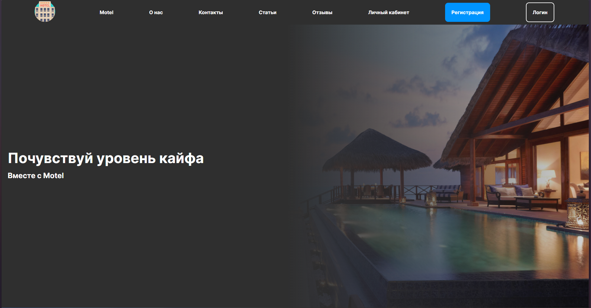

# Веб приложение гостиницы

## Технологии
* Java
* Maven
* Spring Boot
* Spring MVC
* Spring Security
* Lombok
* Java mail sender
* JDBC Template
* PostgreSQL
* HTML/CSS
* JavaScript
## Роли в проекте
* Гость
* Персонал
* Администратор
* Владелец
* Суперпользователь

## Функции приложения
* регистрация и авторизация пользователей по ролям;
* просмотр активных, прошлых и будущих бронирований;
* бронирование номера на определенные даты;
* заказ дополнительных услуг;
* обработка дополнительных услуг персоналом;
* написание и просмотр статей;
* добавление новых услуг;
* оформление финансовой статистики;
* экспорт статистики в формате PDF;
* просмотр, добавление, изменение, удалению аккаунтов сотрудников;
* добавление номеров;
* добавление типов номера;
* отправка данных на почту при создании нового аккаунта с ролью «Владелец», со случайными данными
* добавление отзывов;
* получение консультации по почте.

